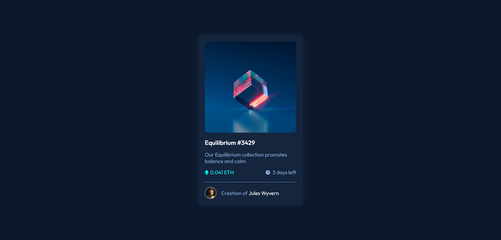

# Frontend Mentor - NFT preview card component solution

This is a solution to the [NFT preview card component challenge on Frontend Mentor](https://www.frontendmentor.io/challenges/nft-preview-card-component-SbdUL_w0U).

## Overview

### The challenge

Users should be able to:

- View the optimal layout depending on their device's screen size
- See hover states for interactive elements

### Screenshot

### Links

- Solution URL: Working on it.

## My process

### Built with

- Semantic HTML5 markup
- CSS custom properties
- Flexbox

### What I learned

In this project i learned how to use flexbox functions to fit the elements in the correct positions, and also used the hover function of css to change some element's styles when they are reached by the user's mouse.

## Author

- GitHub - Vinícius dos Santos Verissimo (https://github.com/viniciusdsv93)
